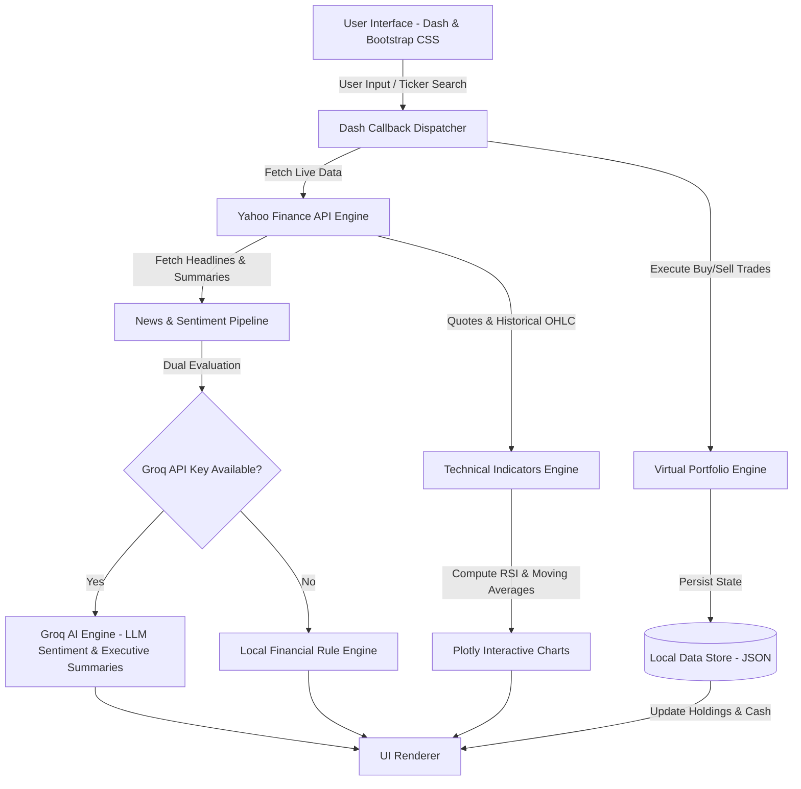

<div align="center">

# 📈 MarketScan

### *Real-Time Global Market Analytics, AI Equity Research & Paper Trading Dashboard*

[](https://www.python.org/)
[](https://dash.plotly.com/)
[](https://plotly.com/)
[](https://groq.com/)
[](LICENSE)

---

**MarketScan** is a full-stack financial analytics web application engineered in Python. It bridges live market data feeds with generative AI to deliver institutional-grade stock research, technical indicator charting, real-time news sentiment classification, and an interactive paper-trading simulation.

</div>

---

## 🌟 Key Features

### 🤖 AI Equity Research Engine (Powered by Groq)
- **Executive Summaries**: Dynamically synthesizes company business models, competitive moats, trailing P/E valuations, 14-day RSI signals, and news catalysts into structured 3-bullet briefings.
- **Smart Rate-Limit Management**: Automatically fallbacks across ultra-fast open LLM models (`openai/gpt-oss-20b`, `qwen/qwen3.8-27b`, etc.) to guarantee zero downtime.
- **Graceful Offline Mode**: Complete fallback engine provided for keyless local execution.

### 🌐 Global Security Coverage & Native Currency Engine
- **Universal Ticker Search**: Search domestic US equities (`AAPL`, `NVDA`, `TSLA`) and international markets (`BMW.DE`, `RELIANCE.NS`, `7203.T`, `BP.L`).
- **Multi-Currency Formatting**: Native currency detection across 20+ currencies (`$`, `€`, `£`, `₹`, `¥`, `CA$`, `AU$`, `CHF`, `₩`, etc.) formatted with precision for prices and market caps.

### 📊 Interactive Charting & Technical Analysis
- **Dynamic Moving Averages**: Adjust technical lookback periods (1–300 days) via dual bi-directional slider and direct numeric inputs.
- **Overlaid Trendlines**: Compare fast custom moving averages against institutional standard benchmarks (e.g., 50-day MA).
- **RSI Oscillator**: Calculates 14-day Relative Strength Index (RSI) with color-coded momentum zones and plain-English market interpretation (Overbought / Oversold / Neutral).

### 📰 Financial News & AI Sentiment Pipeline
- **Smart Deduplication & Filtering**: Scrapes, parses, and scores real-time news articles from Yahoo Finance.
- **Hybrid Sentiment Engine**: Dual-layer architecture combining Groq LLM evaluation with a fast rule engine handling multi-word financial phrases (*"beat estimates"*, *"lowered guidance"*) and negation logic (*"no decline"*).
- **Plain-English Explanations**: Translates complex Wall Street headlines into 2-3 sentence summaries accessible for retail investors.

### 💼 Virtual Paper-Trading Engine
- **$50,000 Starting Portfolio**: Practice strategy execution with virtual cash.
- **Interactive Share Steppers**: Incremental `+` / `-` quick-quantity controls for seamless trade entry.
- **Average Cost Basis Tracking**: Automatic portfolio accounting using weighted average cost basis for multi-lot position scaling.
- **Transaction Ledger**: Logs full trade history (Action, Timestamp, Quantity, Execution Price, Total Value).

---

## 🏗️ Architecture & Data Flow



---

## ⚡ Quick Start

### Prerequisites
- **Python 3.10+** installed on your system.
- Git installed.

### 1. Clone the Repository
```bash
git clone https://github.com/YOUR_USERNAME/MarketScan.git
cd MarketScan
```

### 2. Set Up Virtual Environment
```bash
# Windows
python -m venv .venv
.venv\Scripts\activate

# macOS / Linux
python3 -m venv .venv
source .venv/bin/activate
```

### 3. Install Dependencies
```bash
pip install -r requirements.txt
```

### 4. Configure API Key (Optional)
MarketScan includes a **Free Local Mode**, but for live Groq AI analysis:
1. Obtain a free API key from [Groq Console](https://console.groq.com/).
2. Copy `.env.example` to `.env`:
   ```bash
   cp .env.example .env
   ```
3. Open `.env` and add your key:
   ```env
   GROQ_API_KEY=gsk_your_actual_groq_api_key_here
   ```

### 5. Launch Application
```bash
python app.py
```
Open your browser and navigate to **`http://127.0.0.1:8050/`**

---

## 📁 Repository Structure

```
MarketScan/
├── app.py                      # Server entry point & sys.path configuration
├── config.py                   # Global parameters & indicator defaults
├── requirements.txt            # Production dependencies
├── .env.example                # Environment variables template
├── .gitignore                  # Git exclusion rules (keys, venv, user data)
│
├── stocks/                     # Market data & technical analysis
│   ├── stock_data.py           # yfinance wrappers, multi-currency parser
│   ├── stock_search.py         # Security search & ticker resolution
│   ├── indicators.py           # Technical calculation engine (RSI, MA)
│   └── charts.py               # Charting helper utilities
│
├── news/                       # Sentiment & AI pipeline
│   ├── ai_groq.py              # Groq API client & prompt engineering
│   ├── news_fetcher.py         # News scraper & article parser
│   ├── pipeline.py             # Orchestrator for sentiment & summaries
│   ├── relevance.py            # Headline scoring & filtering
│   ├── sentiment.py            # Dual-layer sentiment engine
│   └── summarizer.py           # Plain-English summary generator
│
├── portfolio/                  # Paper-trading engine & state management
│   ├── portfolio.py            # Portfolio accounting & P/L calculation
│   ├── transactions.py         # Transaction history logger
│   └── watchlist.py            # Dynamic watchlist CRUD operations
│
├── ui/                         # User Interface & Reactive State
│   ├── dashboard.py            # Dash app factory & custom index template
│   ├── layout.py               # Responsive HTML/Dash component layout
│   ├── callbacks.py            # Event callbacks & dynamic state update chain
│   ├── plotly_charts.py        # Dark-themed Plotly figure builders
│   └── assets/
│       └── dashboard.css       # Custom high-contrast dark theme CSS
│
├── utils/                      # Utilities
│   ├── formatters.py           # Currency symbol & market cap formatting
│   └── storage.py              # JSON file persistence handler
│
└── data/                       # Local state directory (tracked via .gitkeep)
    ├── .gitkeep
    ├── portfolio.json          # Fresh $50,000 initial balance
    ├── transactions.json       # Empty trade ledger
    └── watchlist.json          # Empty initial watchlist
```

---

## 🛠️ Technology Stack

| Domain | Technology | Purpose |
|---|---|---|
| **Frontend Framework** | `Dash` (Plotly) | Reactive Web Application Architecture |
| **Interactive Visualization** | `Plotly.py` | Dark-themed Financial & RSI Charts |
| **Market Data Provider** | `yfinance` | Real-Time Quotes, History & Security Metadata |
| **Generative AI** | `Groq API` | Sub-Second LLM Inference (`openai/gpt-oss-20b`) |
| **Data Manipulation** | `Pandas` / `NumPy` | Vectorized Series Math for Technical Indicators |
| **Environment Management** | `python-dotenv` | Zero-Trust API Key Storage |

---

## 🎓 Portfolio Note

> **Developer Note**: MarketScan was engineered as a portfolio project by a high-school senior learning Python software architecture, OOP design, reactive UI callbacks, REST APIs, and LLM integrations. 

---

## 📜 License

Distributed under the **MIT License**. See `LICENSE` for more details.
